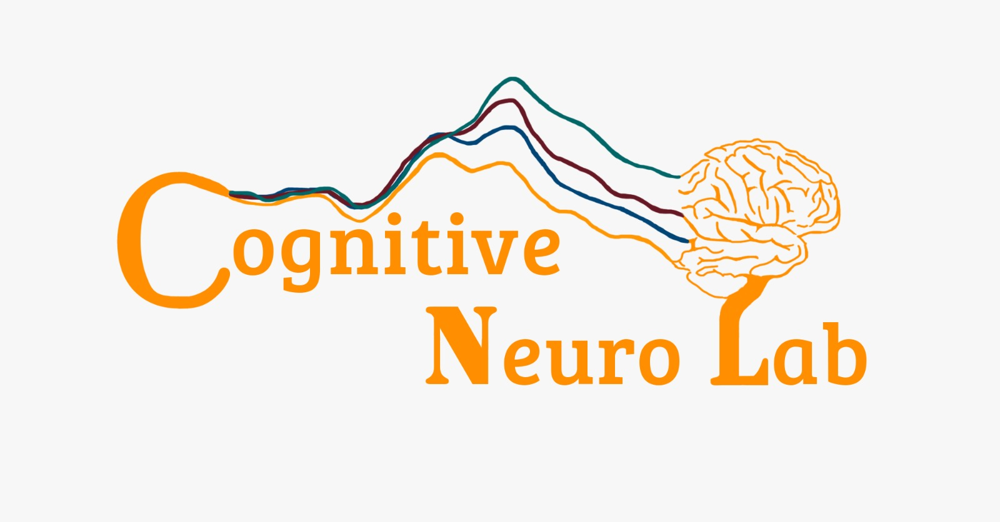

[![Forks][forks-shield]][forks-url]
[![Stargazers][stars-shield]][stars-url]
[![Issues][issues-shield]][issues-url]
[![MIT License][license-shield]][license-url]

 

   

<h3 align="center">ASSR experiment for </h3>

<h4 align="center">ASSR experiment for Presentation® NeuroBehavioral Systems, This task was created for the Rett battery By Olga Sysoeva</h4>

**Table of Contents**
  
1. [About the project](#about-the-project)
    - [Built With](#built-with)
2. [Getting started](#getting-started)
    - [Prerequisites](#prerequisites)  
    - [Installation](#installation)  
3. [Timing, settings and Readme files](#timing-settings-and-readme-files)
3. [License](#license)
3. [Contact](#contact)
3. [Acknowledgement](#acknowledgement)

<!-- ABOUT THE PROJECT -->
## About The Project
Here Tufikami will add the explanation of what the paradigm does

### Built With

* [Presentation® NeuroBehavioral Systems](https://www.neurobs.com/menu_presentation/menu_features/features_overview)

## Timing, settings and Readme files

### Timing
The timing of this paradigm was checked around November 2018. We found out there is a 12ms delay between the trigger onset and the start of the sound. The following is the time between the stimuli per block:

ASSR40_900 - 25ms between stim
ASSR16_500 - 63ms between stim
ASSR40_500 - 25ms between stim

### settings
We used [in-ear earphones](https://www.etymotic.com/product/er1-insert-earphones/) and tested that the volume was around 74dB when we would put the presentation volume (which is the same as the windows volume) to 0.35. Because of the quality of the earplugs, we would not measure the dB for every participant, but we would take note to be sure that the volume always was at 35%. 

We alwayed used presentation V20.1

You can see [the rest of the paradigm settings here](https://github.com/CognitiveNeuroLab/ASSR/tree/main/src/Settings%20%2B%20setup%20%2B%20timing)

### Readme files
All readme files are .txt files and use the following structure: 
~~~~---***run in presentation V 20.1***---~~~

Participant ID: 	
Patient/control
Gender:  Age: Handedness:  Exp:  booth: 
Date: 
Externals: 
Light: on		(normal ON)
volume at: (normal 35%) 
watching:  
Cap: 	(color + #channels)

Notes: general notes on paradigm

1 - 40-500 order - info on this block 
2- 16_500 order - info on this block 
3- 27-500 order - info on this block
4- 40_900 order - info on this block 

## License

Distributed under the MIT License. See `LICENSE` for more information.

<!-- CONTACT -->
## Contact

email - cnl@einsteinmed.org

Project Link: [https://github.com/CognitiveNeuroLab/ASSR/](https://github.com/CognitiveNeuroLab/ASSR/)

<!-- ACKNOWLEDGEMENTS -->
## Acknowledgements

* This paradigm was build by Olga Sysoeva while she was staying in the CNLx

[forks-shield]: https://img.shields.io/github/forks/CognitiveNeuroLab/ASSR.svg?style=for-the-badge
[forks-url]: https://github.com/CognitiveNeuroLab/ASSR/network/members
[stars-shield]: https://img.shields.io/github/stars/CognitiveNeuroLab/ASSR.svg?style=for-the-badge
[stars-url]: https://github.com/CognitiveNeuroLab/ASSR/stargazers
[issues-shield]: https://img.shields.io/github/issues/CognitiveNeuroLab/ASSR.svg?style=for-the-badge
[issues-url]: https://github.com/CognitiveNeuroLab/ASSR/issues
[license-shield]: https://img.shields.io/github/license/CognitiveNeuroLab/ASSR.svg?style=for-the-badge
[license-url]: https://github.com/CognitiveNeuroLab/ASSR/blob/master/LICENSE.txt